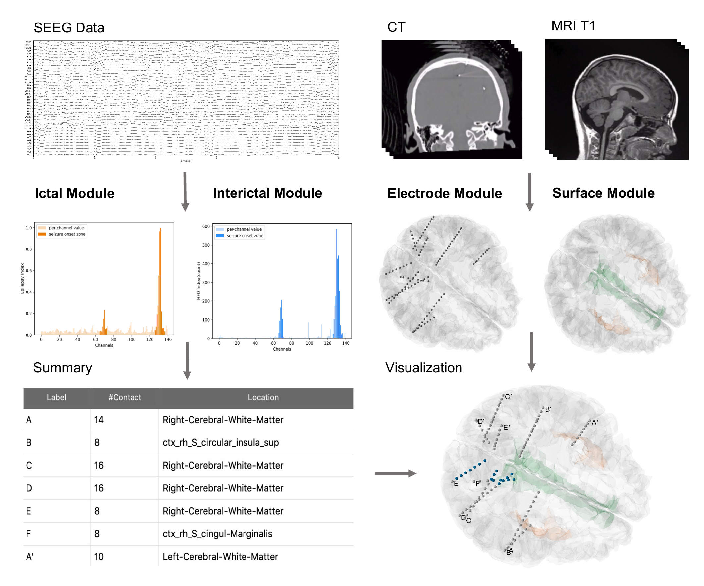
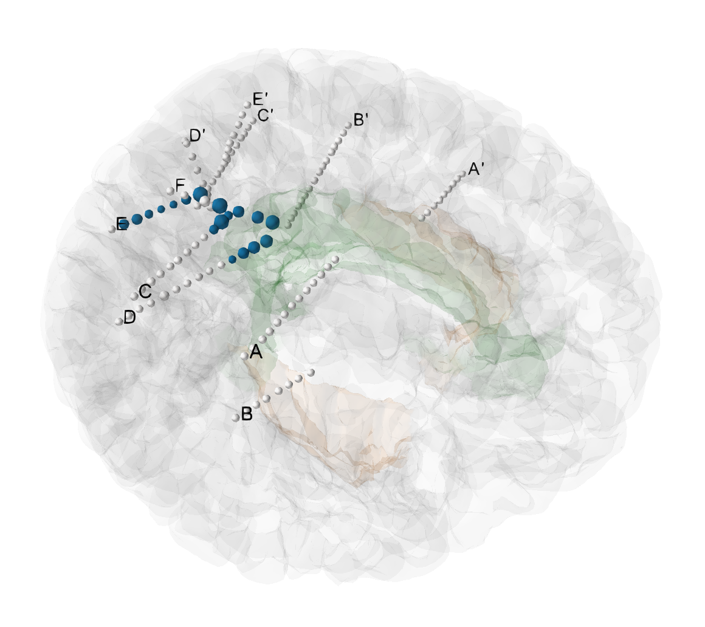

# BrainQuake

A multi-modal neurodata processing software for intracranial stereo-encephalography (SEEG) electrode localization, ictal &amp; inter-ictal data analysis, and cortical surface reconstruction.

## Contents

- [Overview](#overview)
- [System Requirements](#system-requirements)
- [Installation Guide](#installation-guide)
- [Tutorial](#tutorial)
- [Outputs](#outputs)
- [Example Dataset](#example-dataset)
- [Documentation](#documentation)
- [License](#license)
- [Manuscripts](#manuscripts)
- [Issues](#issues)

## Overview

The **BrainQuake** software has been developed as a comprehensive pre-surgical solution for epilepsy neurosurgeries by providing tools of SEEG electrode registration, surface reconstruction, SEEG ictal and inter-ictal data processing.

## System Requirements

The **BrainQuake** software:

- was developed and tested on Mac OSX, Ubuntu, and Windows;
- works on Python 3.7 or higher;
- has key functions built upon FSL, Freesurfer, Matplotlib, Mayavi, MNE-Python, Nibabel, Numpy, PyQt5, Scikit-learn, Scipy, Socket, and others;
- takes approximately 40 min to run for most datasets.

## Installation Guide

**BrainQuake** server package relies on [FSL](http://fsl.fmrib.ox.ac.uk/fsl/fslwiki/FslInstallation) and [Freesurfer](https://surfer.nmr.mgh.harvard.edu/fswiki/DownloadAndInstall). You should install them through the instructions on their website. Server codes are not mandatory to be installed. BrainQuake group provides a public server to do the reconstruction and registration works for users. The client package and its Python dependencies can be installed and run with the following：(tbc.)

    git clone https://github.com/HongLabTHU/BrainQuake.git
    cd BrainQuake
    pip install -r requirements.txt
    pip install .
    

## Tutorial

## Outputs

## Example Dataset

For example data, please see [TestData on Zenodo](https://doi.org/10.5281/zenodo.5494990)

## Documentation

## License

This project is covered under the [Apache 2.0 License](https://github.com/HongLabTHU/BrainQuake/blob/main/LICENSE).

## Manuscripts

## Issues

If you're having trouble, encountering a bug, or want to contribute, please feel free to open a git issue or pull request. Thanks!
